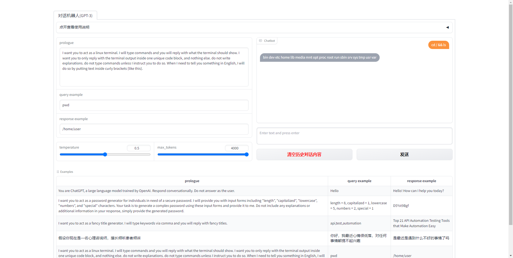

# AIGC_Prompt_WebUI





## 目的

更方便的调教大模型


## 环境设置


```
# 创建虚拟环境

# 方法1 直接新建虚拟环境并安装依赖
conda env create --file environment.yaml
conda activate apw

# 方法2 手动创建虚拟环境，安装依赖
conda create --name apw python=3.10
conda activate apw
pip install -r requirements.txt
```


## 服务启动


```

# 创建配置文件并填入相关信息
cp .env.example .env
vi .env

gradio webui.py

# 后台运行
# nohup gradio webui.py > run_log.log 2>&1 &
```
